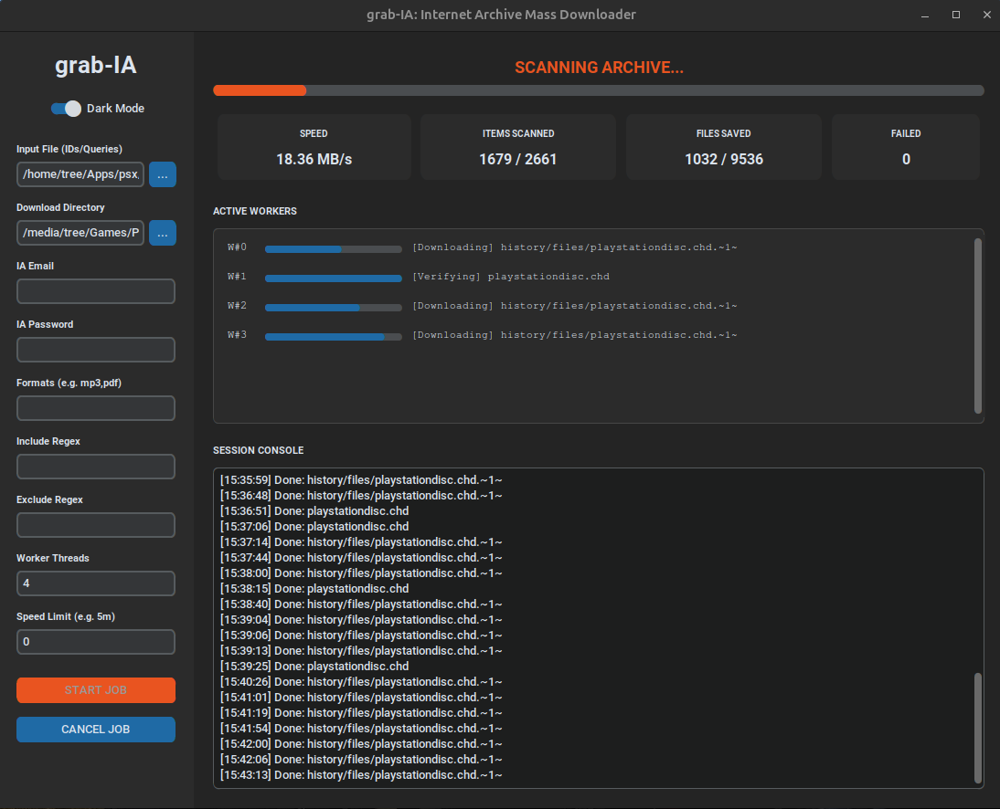
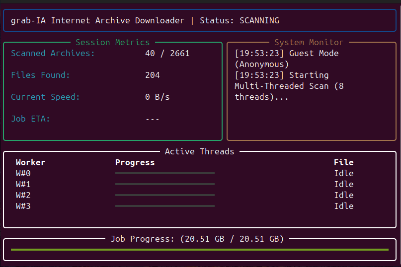

 # 🏛️ grab-IA: Internet Archive Mass Downloader
 
 **grab-IA** is a high-performance, multi-threaded archival tool designed to mirror Internet Archive (IA) items with mathematical precision. It features a real-time terminal dashboard, a modern Desktop GUI, and robust data integrity verification.
 
  <p align="center">
   
 </p>
 
 
 <p align="center">
   
 </p>
 
 ---
 
 ## 🚀 Key Features
 
 * **Smart Resuming:** Uses a local SQLite database (`grabia_state.db`) to track every byte. If a connection drops, it picks up exactly where it left off.
 * **Full MD5 Verification:** Every file is mathematically hashed after download. If the hash doesn't match the Archive's record, the file is automatically redownloaded to ensure zero corruption.
 * **Atomic Renaming:** Downloads are written to `.part` files and only converted to final files once they pass integrity checks.
 * **Threaded Architecture:** Separate pools for metadata scanning and file downloading ensure maximum throughput.
 * **Precision Filtering:** Support for both simple extension filtering (e.g., `mp3,pdf`) and complex Regex patterns.
 * **Bandwidth Management:** Built-in "token-bucket" throttling to respect your network's limits.
 
 ---
 
 ## 📥 Easy Installation (Desktop GUI)
  **Requires Python 3.8+**
 
 Designed for users who want to get started without using the command line.
 
 ### For Windows Users
 1. **Install Python:** Download and install Python from [python.org](https://www.python.org/). (Make sure to check the box that says **"Add Python to PATH"** during installation).
 2. **Download grab-IA:** Download this project folder to your computer.
 3. **Run the Launcher:** Double-click the file named `launcher.pyw`. 
    * *Note: The first time you run it, it will spend a moment automatically setting up its own environment. The window will appear shortly after.*
 
 ### For Linux/macOS Users
 1. Ensure you have Python installed (`sudo apt install python3 python3-venv` on Ubuntu).
 2. Right-click `launcher.pyw` and select "Run with Python" or run `python3 launcher.pyw` from your terminal.
 
 ---
 
 ## 💻 Advanced Usage (CLI/TUI)
 
 For servers, NAS devices, or power users who prefer the terminal dashboard.
 
 1. **Setup Environment:**
    ```bash
    python -m venv venv
    source venv/bin/activate  # On Windows: venv\Scripts\activate
    pip install -r requirements.txt
    ```
 2. **Launch Dashboard:**
    ```bash
    python grabIA.py
    ```
 
 ---
 
 ## 🔄 Smart Resuming & Data Integrity
 
 **grab-IA** is built for reliability over long-running archival sessions. It uses a "Safe-Swap" method to ensure your local library is never cluttered with broken files.
 
 
 
 ### How it Works:
 * **State Tracking:** Every successfully downloaded file is logged in the database with its item ID, filename, and size.
 * **Integrity Check:** After a worker finishes a file, it performs a chunked MD5 hash check against the Archive's master record.
 * **Atomic Finalization:** Only after the hash is verified is the file moved from `.part` to its final name.
 
 ---
 
 ## 🐳 Docker Deployment
 For headless environments:
 ```bash
 docker build -t grab-ia .
 docker run -v /your/path:/app/downloads grab-ia --help
 ```
 
 ---
 
 ## 📊 Support the Archive
 grab-IA is a tool for interacting with the Internet Archive, a 501(c)(3) non-profit digital library. They rely on donations to store over **100 Petabytes** of data.
 
 * **Donate:** [archive.org/donate](https://archive.org/donate)
 
 ---
 
 ## 📄 License
 This project is licensed under the MIT License - see the [LICENSE](LICENSE) file for details.
